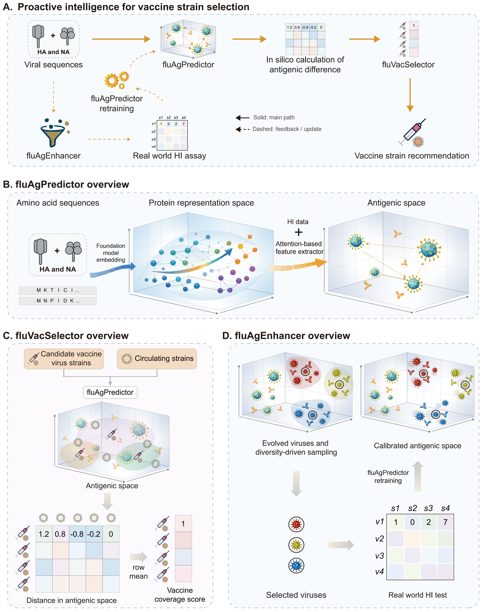
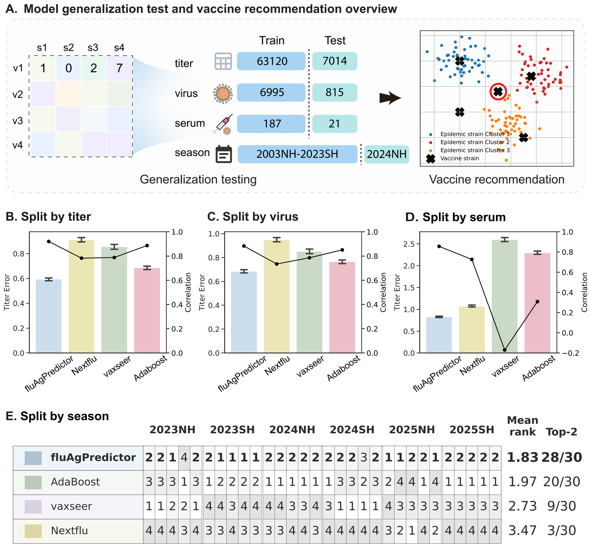
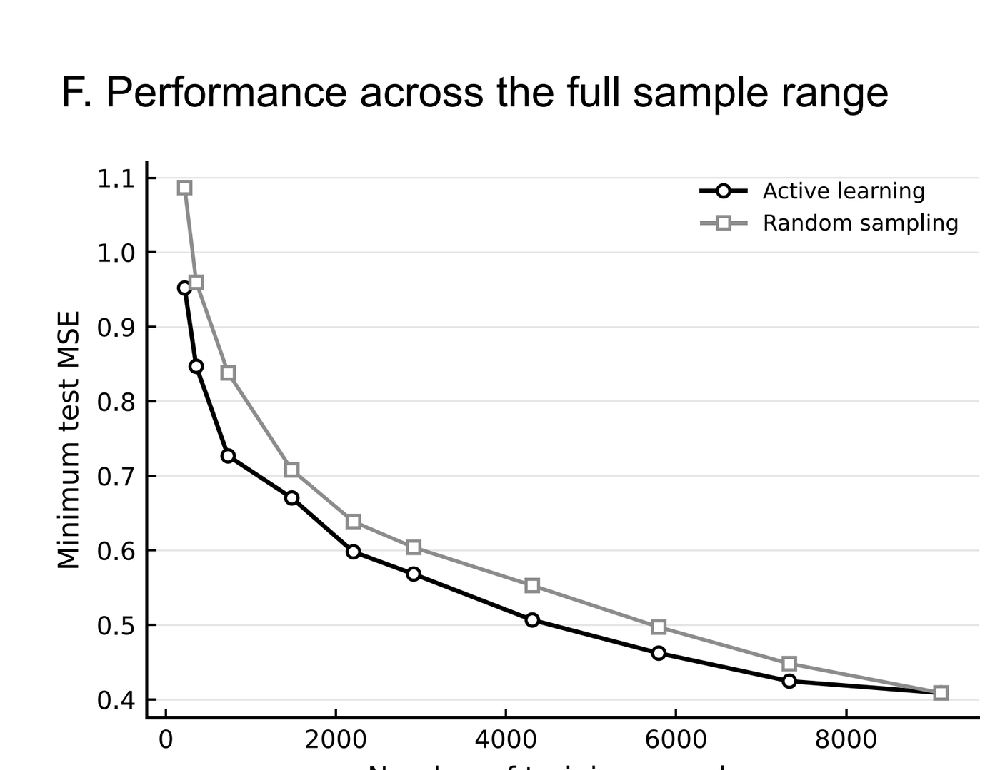

<p align="center">
  
</p>

<h1 align="center">fluProfiler</h1>

<p align="center">
  A foundation-model-based framework for influenza antigenic profiling, vaccine strain ranking, and data-efficient antigenic surveillance.
</p>

<p align="center">
  <a href="https://www.biorxiv.org/content/10.64898/2026.04.18.719333v1"><strong>Preprint on bioRxiv</strong></a>
</p>

<p align="center">
  <em>This preprint has not been peer reviewed.</em>
</p>

<p align="center">
  <a href="https://github.com/Chengxugorilla/fluProfiler"><strong>Project Repository</strong></a> · <strong>Citation information to be added after journal decision</strong>
</p>

## Hosted Web Service

A public fluProfiler web service is being prepared. The production URL and server endpoint will be announced after the required ICP filing is approved.

## Highlights

- `115,927` HI measurements curated from `44` Francis Crick surveillance reports spanning `2003` to `2025SH`
- Sequence-to-antigenic-space modeling for seasonal `H1N1` and `H3N2` using paired `HA` and `NA` sequence information
- Strong surveillance-aligned generalization across titer missingness, virus missingness, serum missingness, and strict temporal extrapolation
- Temporal extrapolation ranked in the top two for `28/30` season-metric evaluation units in the preprint benchmark
- Model-derived antigenic determinants recover known epitope and receptor-binding-site biology without explicit antigenic-site priors
- Diversity-driven active learning reaches the same predictive target with approximately `25%` fewer HI measurements than random sampling

## Framework

<p align="center">
  
</p>

<p align="center">
  <em>Adapted from our bioRxiv preprint. fluProfiler integrates sequence-based antigenic prediction, prospective vaccine candidate ranking, and diversity-driven sampling for iterative HI-guided model updating.</em>
</p>

## Benchmark Snapshot

<p align="center">
  
</p>

<p align="center">
  <em>Adapted from our bioRxiv preprint. Across surveillance-aligned titer, virus, serum, and temporal extrapolation settings, fluAgPredictor shows robust generalization and supports prospective vaccine recommendation.</em>
</p>

## Data-Efficient Model Updating

<p align="center">
  
</p>

<p align="center">
  <em>Adapted from our bioRxiv preprint. fluAgEnhancer reaches the same predictive target with approximately 25% fewer HI measurements than random sampling.</em>
</p>

## What This Repository Contains

| Component | Purpose | Primary entrypoints |
| --- | --- | --- |
| `fluAgPredictor` | Sequence-based antigenic distance prediction and generalization benchmarking | `experiments/HA_only/train_v2_ha_only.py`, `experiments/HANA/train_v2_hana.py`, `src/fluprofiler/cli/dispatch.py` |
| `fluVacSelector` | Prospective vaccine candidate ranking from predicted antigenic coverage | Preprint figures and downstream analysis notebooks/scripts in `paper/` and `experiments/` |
| `fluAgEnhancer` | Diversity-driven active learning for HI prioritization and model updating | `experiments/active_learning/run_active_learning.py`, `src/fluprofiler/active_learning/` |
| `Data preparation` | Dataset-scoped conversion from raw CSVs to processed source files and `titer` / `strain` / `serum` splits | `scripts/prepare_dataset_processed.py`, `scripts/prepare_dataset_splits.py` |
| `Legacy / archived experiments` | Historical exploratory runs retained for reference, not the main recommended path | `src/deprecated/`, parts of `experiments/reverse_tests/` |

## Project Map

| Path | Role in the current repository |
| --- | --- |
| `src/fluprofiler/cli/dispatch.py` | Main CLI dispatcher for the recommended `ha_only` and `hana` training paths |
| `experiments/HA_only/` | Primary HA-only training and inference scripts used in the current restructured workflow |
| `experiments/HANA/` | Primary HA+NA training scripts for the current restructured workflow |
| `src/fluprofiler/models/` | Legacy and comparative model architectures, pooling layers, and loss utilities |
| `src/fluprofiler/models_v2/` | Newer v2 model I/O contracts and streamlined HA / HANA implementations |
| `src/fluprofiler/active_learning/` | Modular active-learning utilities, strategies, and loop abstractions |
| `experiments/active_learning/` | Executable active-learning experiment scripts and notebooks |
| `scripts/prepare_dataset_processed.py` | Dataset-scoped raw CSV normalization, sequence ID assignment, embedding registry update, and processed `source.csv` generation |
| `scripts/prepare_dataset_splits.py` | Dataset-scoped split generation from `processed/source.csv` into `splited/` |
| `experiments/tools/build_splits.py` | Lower-level split builder reused by the script entrypoint |
| `data/dataset/` | Dataset-scoped raw, processed, and split outputs |
| `data/embedding/` | Global sequence registry and embedding tensor store |
| `runs/` | Stored run artifacts, metadata, and TensorBoard logs from previous experiments |
| `paper/` | Figure-generation notebooks, paper assets, and supplementary materials |
| `src/deprecated/` | Archived historical experiments retained for provenance and reference |

## Quick Start Status

This repository currently exposes the main research code and figure assets used in the bioRxiv preprint, but it is **not yet packaged as a fully self-contained pip-installable release**.

Important current limitations:

- No checked-in `requirements.txt`, `pyproject.toml`, or environment lockfile is present in the repository at this time.
- The main training scripts expect external data assets, including split CSVs and embedding `.pt` files.
- The current training entrypoints also expect `configs/args.pkl`, which is referenced by the code but not included in this repository snapshot.

As a result, the most reliable immediate use of this repository is:

- read the preprint and inspect the framework/results assets in this repository;
- review the main experiment entrypoints under `experiments/HA_only/`, `experiments/HANA/`, and `experiments/tools/`;
- reuse or adapt the code within an existing local research environment that already contains the required datasets and training assets.

## Reproducibility Notes

- The repository includes core source code, figure assets, split manifests, and selected run metadata used to support the bioRxiv preprint.
- The repository does **not** currently include a complete, one-command reproducibility environment specification such as `requirements.txt`, `pyproject.toml`, or a frozen conda environment file.
- The repository also does **not** currently include all runtime training assets needed for direct execution, including embedding `.pt` files, the full split CSV payloads, or `configs/args.pkl`.
- Some paths inside configs, manifests, and historical run metadata still reflect the original local research environment used during development and benchmarking.
- The `data/dataset/<dataset>/splited/` trees provide protocol and manifest examples that document how dataset partitioning was performed, even when the full underlying raw data are not mirrored in the repository.
- The preprint states that processed matched datasets, source data, and code are available through this repository and/or supplementary materials; readers should interpret the GitHub repository as the code-centered companion rather than a fully self-contained binary release.
- Sequence data provenance is tied to GISAID-derived records and Francis Crick HI surveillance reports, so downstream redistribution and reconstruction may depend on the applicable source-data usage terms.

## Environment Setup

Recommended:

- Python `3.10`
- Linux + CUDA GPU (for training speed)

Recommended baseline:

```bash
conda create -n fluProfiler python=3.10
conda activate fluProfiler
```

You will likely need a local scientific Python environment including at least:

- `torch`
- `transformers`
- `pandas`
- `numpy`
- `scikit-learn`
- `scipy`
- `biopython`
- `tensorboard`

Verify PyTorch GPU availability (optional):

```bash
python -c "import torch; print(torch.cuda.is_available(), torch.cuda.device_count())"
```

## Required Data Layout

The current data flow uses one global embedding store and one directory per dataset:

```text
data/
├── embedding/
│   ├── registry/
│   │   ├── sequences.csv
│   │   └── pending/
│   └── files/
│       └── matrix_<seq_id>.pt
└── dataset/
    └── H1H3_new/
        ├── raw/
        ├── processed/
        └── splited/
```

Training uses split CSV files from `data/dataset/<dataset>/splited/...` and embedding tensors from `data/embedding/files/matrix_<seq_id>.pt`.

Check and edit config paths before running:

- `experiments/HA_only/config_v2_ha_only.json`
- `experiments/HANA/config_v2_hana.json`

## Recommended Run Method (Single Entry)

Use the top-level script:

```bash
bash run_fluprofiler.sh
```

Edit parameters at the top of `run_fluprofiler.sh`:

- `task`: `ha_only` or `hana`
- `impl`: `v2` or `legacy`
- `config`: config file path
- `batch_size`
- `learning_rate`
- `epochs`
- `device` (example: `cuda:0`)
- `gpu_cache_gb`
- `sample_limit` (`-1` = full data, small value = quick test)

Note:

- the shell wrapper currently exposes fixed variables at the top of `run_fluprofiler.sh`;
- the README example below reflects the intended usage pattern, but the wrapper is not yet a polished CLI.

Example intended quick smoke test pattern:

```bash
bash run_fluprofiler.sh --sample-limit 128 --epochs 1 --batch-size 8
```

## Direct Commands (Optional)

If you want to bypass the shell entry:

```bash
# HA-only v2
python experiments/HA_only/train_v2_ha_only.py experiments/HA_only/config_v2_ha_only.json

# HANA v2
python experiments/HANA/train_v2_hana.py experiments/HANA/config_v2_hana.json
```

Dispatcher usage from repo root:

```bash
PYTHONPATH=src python src/fluprofiler/cli/dispatch.py --task ha_only --impl v2
PYTHONPATH=src python src/fluprofiler/cli/dispatch.py --task hana --impl v2
```

## Outputs

Run artifacts are saved under `runs/`, including:

- TensorBoard logs
- Checkpoints
- Run logs / metadata

## Raw To Splited Data Flow

Put each dataset under `data/dataset/<dataset_name>/`. Raw CSV files go in `raw/`; generated files go to `processed/` and `splited/`.

```text
data/dataset/H1H3_new/
├── raw/
│   ├── data4model(Crick-H1N1).csv
│   └── data4model(Crick-H3N2).csv
├── processed/
│   ├── source.csv
│   └── qc_summary.json
└── splited/
    └── v1/<split_id>/{titer,strain,serum}/
        ├── train.csv
        ├── valid.csv
        ├── test.csv
        └── manifest.json
```

### Step 1: Raw To Processed

Run:

```bash
python scripts/prepare_dataset_processed.py --dataset-dir data/dataset/H1H3_new
```

This reads all raw CSV files under `raw/`, validates required columns, converts `label` to numeric, removes rows missing `label` or any of `seq_a`, `seq_b`, `seq_c`, `seq_d`, normalizes passage categories, assigns `seq_id_a` / `seq_id_b` / `seq_id_c` / `seq_id_d`, updates `data/embedding/registry/sequences.csv`, and writes:

```text
data/dataset/H1H3_new/processed/source.csv
data/dataset/H1H3_new/processed/qc_summary.json
```

`qc_summary.json` records each processing step, including rows before/after, deleted rows, passage normalization counts, new sequence counts, and missing embedding counts. If any used sequence has no embedding file, one timestamped FASTA is written to:

```text
data/embedding/registry/pending/<timestamp>.fasta
```

The pending FASTA is intended to be sent to the embedding pipeline. After the corresponding `matrix_<seq_id>.pt` files are generated under `data/embedding/files/`, rerun the processing step if needed.

### Step 2: Processed To Splited

Run:

```bash
python scripts/prepare_dataset_splits.py --dataset-dir data/dataset/H1H3_new
```

This reads `processed/source.csv` and generates three split modes:

- `titer`  (row-level random split)
- `strain` (group split by strain key, default `seq_id_c`)
- `serum`  (group split by serum key, default `seq_id_a`)

Default split settings are `seed=42`, `test_ratio=0.1`, `valid_ratio=0.1`, `group_valid=false`, and `split_modes=titer,strain,serum`. To make the split reproducible by name, pass `--split-id`:

```bash
python scripts/prepare_dataset_splits.py \
  --dataset-dir data/dataset/H1H3_new \
  --split-id H1H3_new__seed42__tr0.80_va0.10_te0.10
```

Generated files:

```text
data/dataset/H1H3_new/splited/v1/<split_id>/
├── titer/{train.csv,valid.csv,test.csv,manifest.json}
├── strain/{train.csv,valid.csv,test.csv,manifest.json}
└── serum/{train.csv,valid.csv,test.csv,manifest.json}
```

Each `manifest.json` records split parameters, source checksum, dataset metadata, row counts, duplicate aggregation reports, overlap checks, and group leakage checks.

Notes:

- `scripts/prepare_dataset_splits.py` is the recommended entrypoint for the new data layout.
- `experiments/tools/build_splits.py` remains available as the lower-level standalone split builder.
- Use `--id-col` if `processed/source.csv` has a stable unique row identifier.
- `--split-modes` controls which splits are generated (for example: `titer,serum`).

## Troubleshooting

### CUDA Out of Memory

Reduce memory pressure by:

- Lowering `batch_size` (e.g. `64 -> 16 -> 8`)
- Lowering `gpu_cache_gb`
- Switching to a less busy GPU (`device`)
- Using a small `sample_limit` for validation first

Optional allocator setting:

```bash
export PYTORCH_CUDA_ALLOC_CONF=expandable_segments:True
```

### `CalledProcessError`

This is usually a wrapper error from the dispatcher.  
Check the first traceback above it to find the real cause.
