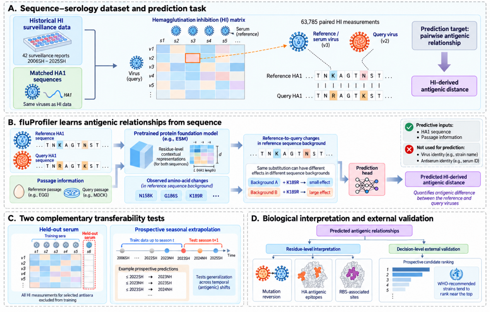
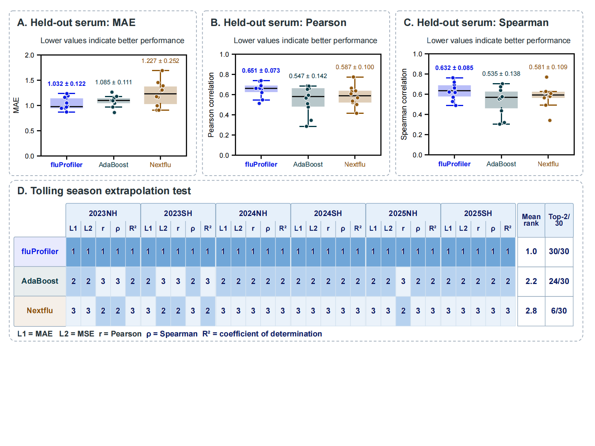
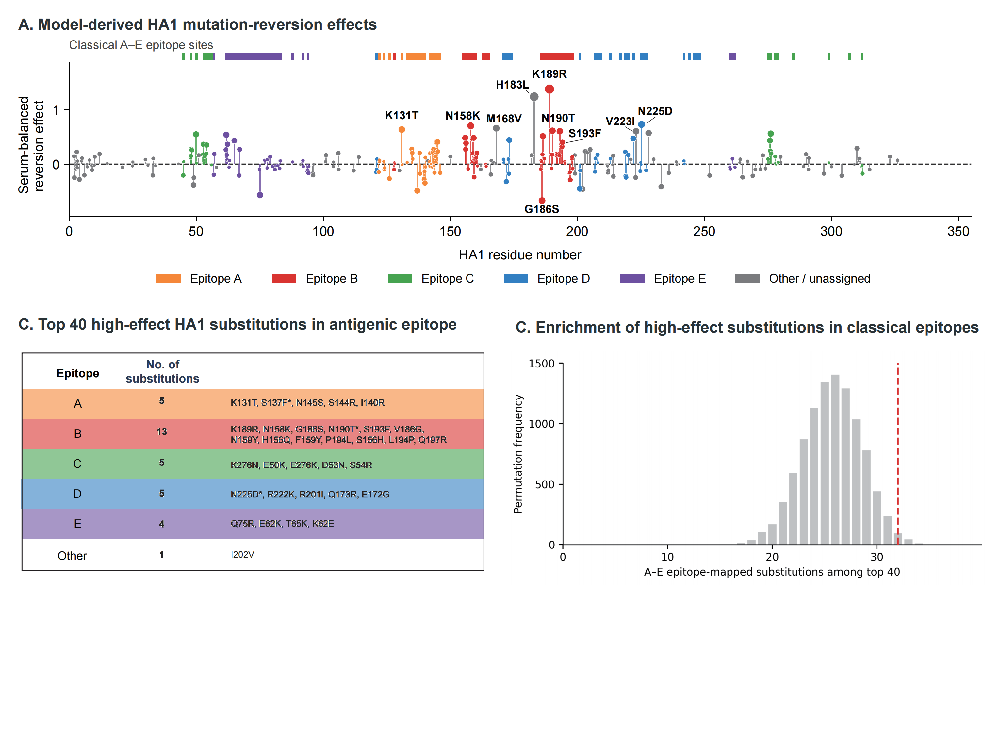
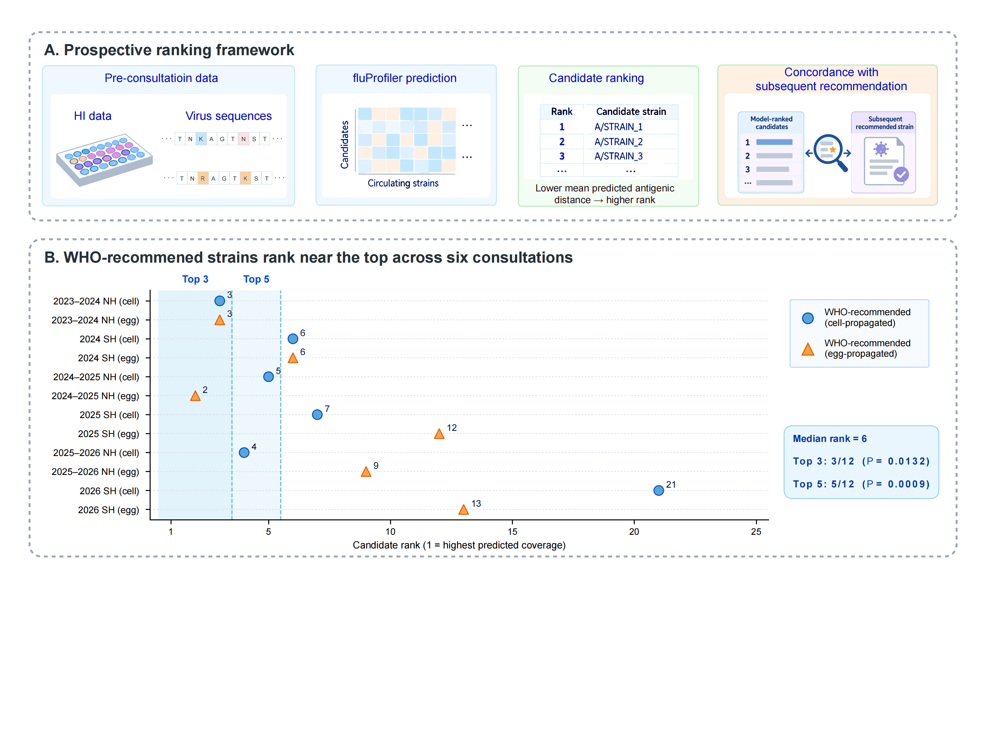

<p align="center">
  
</p>

<h1 align="center">fluProfiler</h1>

<p align="center">
  Transferable antigenic inference for influenza A(H3N2) from HA1 sequence context, without virus- or antiserum-specific identity terms.
</p>

<p align="center">
  <a href="https://github.com/Chengxugorilla/fluProfiler"><strong>Project Repository</strong></a> · <strong>Citation information will be added after journal publication</strong>
</p>

## Hosted Web Service

A public fluProfiler web service is being prepared. The production URL and server endpoint will be announced after the required ICP filing is approved.

## Highlights

- `63,785` paired H3N2 HI measurements from `42` Francis Crick surveillance reports spanning `2006SH` to `2025SH`
- HA1 sequence-context modeling of reference-to-query amino-acid changes, with passage information but without virus- or antiserum-identity inputs
- Robust prediction for completely held-out antiserum conditions across ten matched evaluation splits
- First-place performance in all `30/30` season-metric units across six prospective seasonal evaluations
- Model-derived substitution effects enriched in established H3 antigenic epitopes (`32/40` top-ranked substitutions; permutation `P = 0.0157`)
- Prospective antigenicity-based ranking places WHO-recommended H3N2 strains near the top across consecutive vaccine-composition consultations

## Study Overview

<p align="center">
  
</p>

<p align="center">
  <em>fluProfiler learns pairwise antigenic relationships from HA1 sequence context and passage information. The current study evaluates transfer to held-out sera and future seasons, followed by residue-level interpretation and prospective vaccine-candidate ranking.</em>
</p>

## Generalization Benchmark

<p align="center">
  
</p>

<p align="center">
  <em>Across ten held-out-serum splits, fluProfiler is compared with identity-free AdaBoost and Nextflu baselines. In six rolling seasonal evaluations, fluProfiler ranks first for all five reported metrics in every season.</em>
</p>

## Biological Interpretation

<p align="center">
  
</p>

<p align="center">
  <em>Mutation-reversion analysis identifies HA1 substitutions with large model-predicted antigenic effects and tests their enrichment in the classical H3 A–E antigenic epitopes.</em>
</p>

## Prospective Vaccine-Candidate Ranking

<p align="center">
  
</p>

<p align="center">
  <em>Candidate strains are ranked by their mean predicted antigenic distance to the contemporaneous circulating-virus panel using only pre-consultation information, then compared with subsequent WHO recommendations.</em>
</p>

## What This Repository Contains

| Component | Role in the current manuscript | Primary entrypoints |
| --- | --- | --- |
| `fluProfiler` H3N2 model | Identity-free HA1 sequence-context modeling of pairwise HI-derived antigenic distance | `experiments/serum_gate/train_serum_mutation_set.py`, `src/fluprofiler/models/serum_mutation_set_model.py` |
| Held-out-serum evaluation | Ten matched serum-level splits and identity-free baseline comparisons | `experiments/tools/export_heldout_serum_benchmark.py`, `paper/Code/plot_fig2_heldout_serum_splits.py` |
| Prospective seasonal evaluation | Rolling evaluation on six immediately following influenza seasons | `paper/Code/plot_fig2d_seasonal_rank.py`, `paper/Code/plot_h3n2_season_prediction_scatters_without_name.py` |
| Residue-level interpretation | Full-embedding mutation reversion and observed-substitution summaries | `experiments/serum_gate/run_full_embedding_reversion_deduplicated.py`, `experiments/serum_gate/generate_observed_reversion_table.py` |
| Vaccine-candidate ranking | Consultation-specific prediction and candidate ranking | `paper/Code/Fig4_SCMS_FiLM_20260902/run_vaccine_selection.py` |
| Pairwise baselines | Matched AdaBoost and Nextflu comparisons without identity terms | `experiments/benchmark_pairwise/` |
| Data utilities | Dataset processing, split construction, HA1 extraction, and embedding registries | `scripts/`, `experiments/tools/`, `src/fluprofiler/dataset/` |

The repository also retains broader and earlier research workflows for H1N1, paired HA+NA modeling, active learning, and exploratory analyses. These are useful for provenance and further development, but they are not the primary analysis described by the current H3N2 manuscript. Relevant locations include `experiments/HA_only/`, `experiments/HANA/`, `src/fluprofiler/active_learning/`, `experiments/active_learning/`, and `src/deprecated/`.

## Project Map

| Path | Purpose |
| --- | --- |
| `experiments/serum_gate/` | Current HA1 sequence-context training, inference, ablation, and interpretation workflows |
| `src/fluprofiler/models/serum_mutation_set_model.py` | Main reference-background and mutation-set model implementation |
| `experiments/benchmark_pairwise/` | AdaBoost and Nextflu matched baselines |
| `experiments/tools/` | Benchmark export and dataset/split helpers |
| `scripts/` | Data preparation, embedding, plotting, and experiment launch utilities |
| `paper/Code/` | Figure generation and manuscript-facing analyses |
| `data/dataset/H3_HA1_v1.0/` | Current local H3N2 HA1 dataset, split definitions, and interpretation inputs |
| `data/embedding/` | Sequence registry and local foundation-model embedding store |
| `results/` | Local predictions, checkpoints, metrics, and interpretation outputs |
| `src/deprecated/` | Archived exploratory workflows retained for provenance |

## Quick Start Status

This repository is a code-centered research companion and is not yet packaged as a fully self-contained, pip-installable release.

Important current limitations:

- The current manuscript analyses require local HI-derived datasets and foundation-model embeddings that are not committed to Git.
- Trained checkpoints and most generated results are intentionally excluded from version control.
- Some scripts preserve dataset version identifiers and paths from the research environment in which the analyses were run.
- A single frozen environment or one-command end-to-end reproduction workflow is not yet provided.

The most reliable immediate uses of the repository are therefore to inspect the model and analysis code, reproduce individual stages in an environment containing the required data assets, and regenerate manuscript figures from saved predictions.

## Reproducibility and Data Notes

- The primary manuscript dataset is the H3N2 HA1 collection represented locally by `data/dataset/H3_HA1_v1.0/`.
- Sequence data provenance is tied to GISAID-derived records, while HI measurements are curated from Francis Crick Worldwide Influenza Centre surveillance reports. Redistribution and reconstruction remain subject to the applicable source-data terms.
- Dataset manifests document split parameters and leakage checks even when the underlying CSV payloads are not distributed through Git.
- Model checkpoints, embedding tensors, raw/processed CSV files, and generated result directories are excluded from Git because they are large or source-restricted.
- Paths under `results/` and `data/` may need to be adjusted for a new local environment.

## Environment Setup

Recommended environment:

- Python `3.10`
- Linux
- CUDA-capable GPU for training and embedding-heavy inference

Create and activate the project environment:

```bash
conda create -n fluProfiler python=3.10
conda activate fluProfiler
```

The main workflows use packages including:

- `torch`
- `transformers`
- `pandas`
- `numpy`
- `scikit-learn`
- `scipy`
- `biopython`
- `tensorboard`

Verify GPU availability:

```bash
conda run -n fluProfiler python -c "import torch; print(torch.cuda.is_available(), torch.cuda.device_count())"
```

## Current Manuscript Data Layout

The current H3N2 analysis expects a local layout similar to:

```text
data/
├── embedding/
│   ├── registry/
│   └── files/
│       └── matrix_<seq_id>.pt
└── dataset/
    └── H3_HA1_v1.0/
        ├── raw/
        │   └── data4model(Crick-H3N2).csv
        ├── processed/
        │   └── source.csv
        ├── splited/
        │   └── <split_version>/
        │       ├── serum/seed_<n>/{train,valid,test}.csv
        │       └── season/<season_id>/{train,valid,test}.csv
        └── interpretation/
            └── full_data/{train,valid,test}.csv
```

The primary model uses aligned HA1 embeddings for the serum/reference and query viruses, their observed amino-acid differences, passage metadata, and the HI-derived antigenic-distance label. Virus and antiserum names may be retained for matching and split construction, but are not used as predictive inputs in the primary model.

## Minimal Model Invocation

The current trainer is `experiments/serum_gate/train_serum_mutation_set.py`. A small interface smoke run can be launched with local assets as follows:

```bash
conda run -n fluProfiler python \
  experiments/serum_gate/train_serum_mutation_set.py \
  --data-dir data/dataset/H3_HA1_v1.0/splited/<split_version>/serum/seed_0 \
  --embedding-dir data/embedding/files \
  --ha-distance-matrix ha1_distance_no_bias_329.npy \
  --output-dir results/smoke/fluProfiler-H3N2 \
  --type H3N2 \
  --sample-limit 128 \
  --epochs 1 \
  --device cuda:0
```

This command checks the local data/model interface; it is not the full manuscript training protocol. For manuscript-facing analyses, use the matched split versions, saved run metadata, and fixed hyperparameters associated with the relevant result directory.

## Figure Regeneration

Once the corresponding predictions are available, the main benchmark panels can be regenerated with:

```bash
conda run -n fluProfiler python paper/Code/plot_fig2_heldout_serum_splits.py
conda run -n fluProfiler python paper/Code/plot_fig2d_seasonal_rank.py
```

The prospective vaccine-ranking workflow is implemented in:

```text
paper/Code/Fig4_SCMS_FiLM_20260902/run_vaccine_selection.py
```

Most plotting scripts accept explicit result and output directories; run them with `--help` before adapting them to a different dataset version.

## Additional and Historical Workflows

The following components remain available but are outside the primary scope of the current H3N2 manuscript:

- `experiments/HA_only/`: earlier HA-only training and inference workflows
- `experiments/HANA/`: paired HA+NA modeling
- `src/fluprofiler/active_learning/` and `experiments/active_learning/`: diversity-driven sampling research
- `experiments/reverse_tests/`: earlier seasonal extrapolation experiments
- `src/deprecated/`: archived notebooks and scripts retained for provenance
- `run_fluprofiler.sh`: legacy top-level dispatcher for the earlier HA-only/HANA workflow

## Outputs

Generated assets are normally written under `results/` or `runs/` and may include:

- model checkpoints;
- test-set predictions;
- regression metrics and split audits;
- TensorBoard logs and run metadata;
- mutation-reversion and attribution outputs;
- vaccine-candidate rankings and manuscript figures.

These directories are treated as local research artifacts and are not intended to be committed wholesale.

## Troubleshooting

### CUDA Out of Memory

Reduce memory pressure by:

- lowering `batch_size`;
- lowering `max_queries_per_task`;
- lowering `gpu_cache_gb`;
- selecting a less busy GPU;
- using `--sample-limit` for an interface check before a full run.

Optional allocator setting:

```bash
export PYTORCH_CUDA_ALLOC_CONF=expandable_segments:True
```

### `CalledProcessError`

This is usually a wrapper error from a dispatcher or launch script. Check the first traceback above it to identify the underlying failure.
